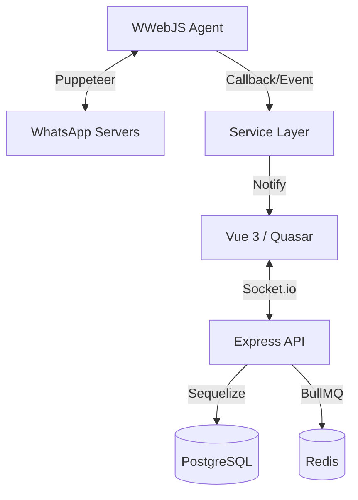

# Arquitetura do Sistema

O TikTickets-zing v4 Enterprise utiliza uma arquitetura **Monolítica Modular** baseada em TypeScript, projetada para alta disponibilidade, isolamento Multi-Tenancy e processamento de eventos em larga escala.

## Camadas e Responsabilidades

### 1. Camada de API (MVC Adaptado)
- **Localização**: `backend/src/routes/` e `backend/src/controllers/`.
- **Papel**: Atua como a interface de entrada via HTTP.
- **Middleware isAuth**: Decodifica o JWT e injeta via `req.user` o `userId` e o `tenantId` em todas as requisições, garantindo que a lógica de negócio receba o contexto de isolamento correto.

### 2. Camada de Serviço (Core Business)
- **Localização**: `backend/src/services/`.
- **Papel**: Onde reside 90% da inteligência do sistema. Os Controllers nunca acessam o DB diretamente; eles invocam Services que garantem a integridade das regras de negócio e o filtro por `tenantId`.

### 3. Camada de Integração (Wbot Engine)
- **Localização**: `backend/src/libs/wbot.ts`.
- **Mecanismos Core**:
  - **Sessões Multi-Client**: Gerencia múltiplas instâncias do `whatsapp-web.js`.
  - **Watchdog**: Monitora o evento `ready` e usa o `verifyRealConnection` (tentativas de leitura de perfil e escrita no DB) para evitar sessões em estado "zumbi".
  - **Reconexão Inteligente**: Implementa estratégias de limpeza de cache e reinicialização de processos Chromium órfãos.

### 4. Camada de Filas (BullMQ)
- **Localização**: `backend/src/libs/Queue.ts`.
- **Infraestrutura**: Baseada em Redis (DB 3).
- **Consumidores**:
  - `SendMessages`: Processa o envio de mensagens para evitar bloqueios de API.
  - `CampaignProcess`: Orquestra o disparo de campanhas em massa respeitando limites de vazão.
  - `WebHooksAPI`: Gerencia a entrega de eventos para integrações externas.

### 5. Camada Real-time (Socket.io)
- **Localização**: `backend/src/libs/socket.ts`.
- **Arquitetura**: Utiliza `socket.io-redis` para permitir que o backend escale horizontalmente.
- **Namespacing**: Baseia a comunicação em salas por `tenantId` e sub-salas por `ticketId`, garantindo que um atendente receba apenas as mensagens de sua própria empresa.

## Fluxo de Sincronia de Dados

## Diretórios Chave
- `backend/src/libs/`: Motores de infraestrutura (Socket, Queue, Wbot).
- `backend/src/services/`: Lógica de negócio segmentada.
- `backend/src/models/`: Definições de tabelas e relacionamentos Sequelize.
- `frontend-vue-3/src/stores/`: Gerenciamento de estado (Pinia) espelhando o backend.

## Recursos Relacionados
- [data-flow.md](./data-flow.md)
- [api.md](./api.md)
- [security.md](./security.md)
