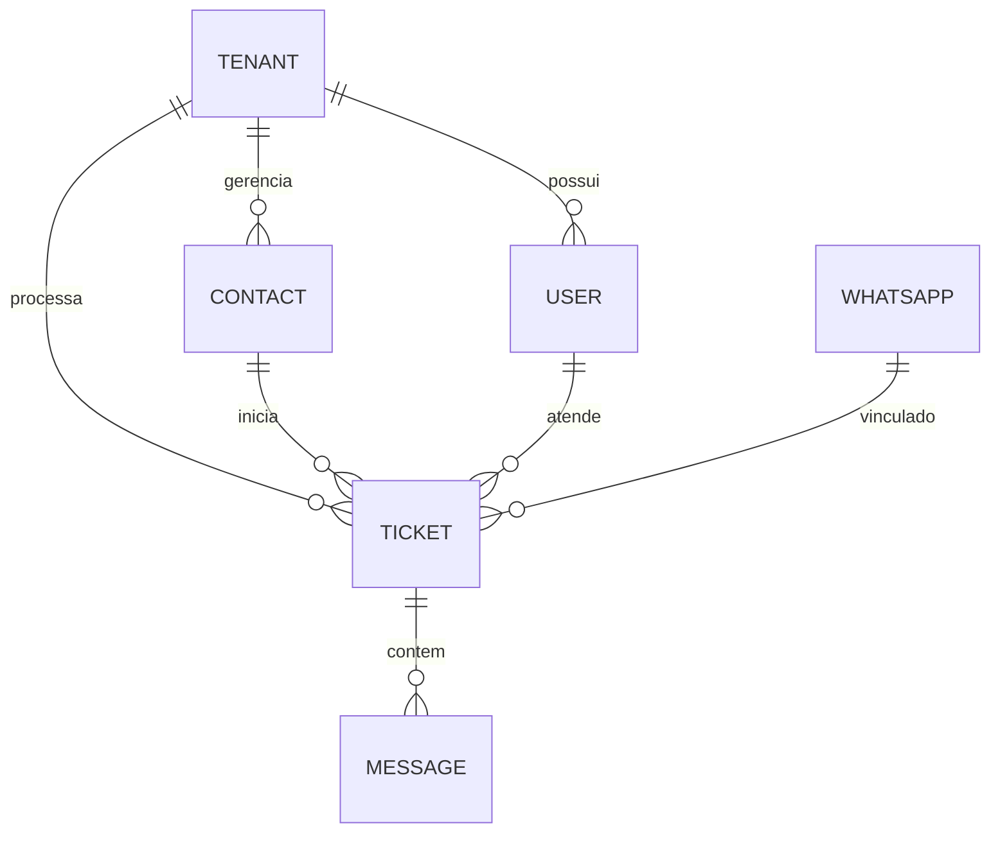

# Banco de Dados e Modelos

O TikTickets-zing utiliza **PostgreSQL** como banco de dados relacional e **Sequelize** (com TypeScript) como ORM.

## Estratégia Multi-Tenancy

O isolamento é feito via **Shared Schema (Schema Compartilhado)**:
*   Cada tabela (exceto tabelas globais de sistema) possui uma coluna `tenantId` (Integer).
*   **Índices**: Todas as buscas principais são compostas `(id, tenantId)` ou `(number, tenantId)` para garantir performance.

## Modelos Principais e Relações

### 1. Tenancy e Usuários
- **`Tenant`**: Define uma empresa/instância no sistema.
- **`User`**: Pertence a um `Tenant`. Pode ter perfil `admin` ou `user`.
- **`UserQueue`**: Tabela de associação entre usuários e filas de atendimento.

### 2. Atendimento
- **`Contact`**: Cadastro de clientes. `tenantId` garante que o contato de uma empresa não apareça para outra.
- **`Ticket`**: O objeto central do sistema.
  - Relaciona-se com `Contact`, `User`, `Queue` e `Whatsapp`.
  - Estados: `pending`, `open`, `closed`.
- **`Message`**: Vinculada a um `Ticket`. Armazena o `body`, paths de mídia e metadados do `wwebjs`.

### 3. Automação e Canais
- **`Whatsapp`**: Configurações da sessão do WhatsApp. Armazena o path da sessão do Puppeteer.
- **`Campaign`**: Configurações de disparos em massa.
- **`Queue`**: Filas de atendimento (Ex: Suporte, Vendas).

## Diagrama ER Simplificado

## Diretório de Migrações
Localizado em `backend/src/database/migrations/`.
- Cada mudança no esquema é versionada.
- **Semente (Seeds)**: Localizados em `backend/src/database/seeds/` para popular usuários admin iniciais.

## Performance e Redis
O banco de dados não é usado para dados efêmeros:
- **Redis (DB 3)**: Armazena o estado das filas do BullMQ e metadados de presença do socket.
- **Cache de Sessão**: Alguns dados de autenticação do `wwebjs` podem ser cacheados em memória para acelerar o boot.

## Recursos Relacionados
- [architecture.md](./architecture.md)
- [api.md](./api.md)
