# TikTickets-zing v3.3.0 🚀
[](https://chat.whatsapp.com/GHNJVQRoLzrGuO1lmCr7vR)
[](https://go.dev/)
[](https://vuejs.org/)
[](https://quasar.dev/)
[](https://pinia.vuejs.org/)
[](https://vitejs.dev/)

Um ecossistema **SaaS Multi-tenant** avançado para gestão de atendimento multicanais centralizado, com **backend de alta performance reescrito em Golang** e frontend moderno em **Vue 3**, sob a marca **TikTickets**.

---

## 📸 Demonstração Visual

<div align="center">
  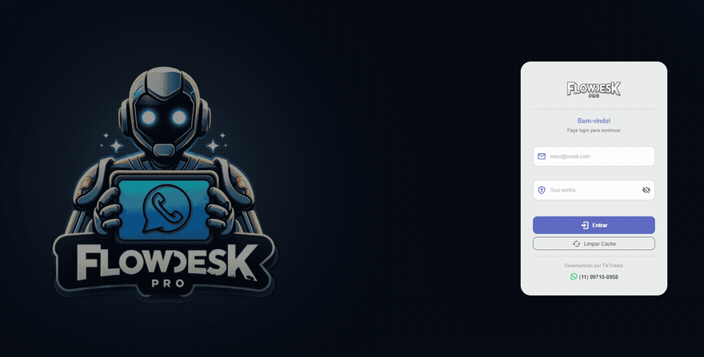
</div>

<details>
  <summary><b>🔍 Clique para expandir as capturas de tela detalhadas</b></summary>

  ### 🔐 1. Tela de Login Moderna
  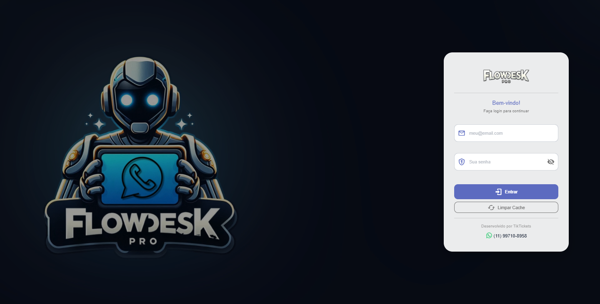

  ### 📊 2. Dashboard Operacional (Métricas & Estatísticas)
  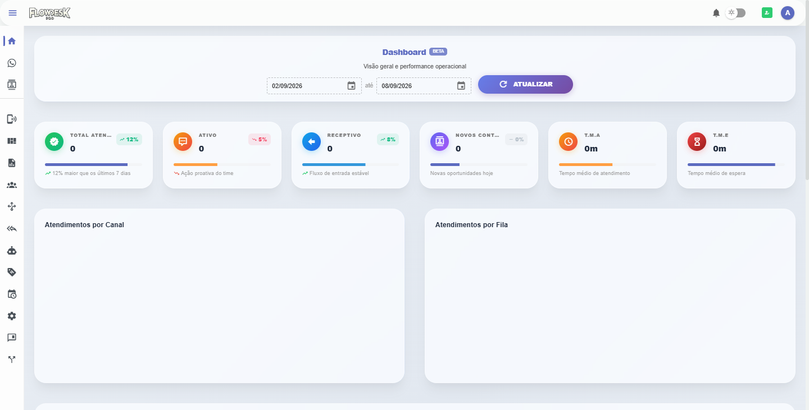

  ### 💬 3. Central de Atendimento e Chats Multicanal
  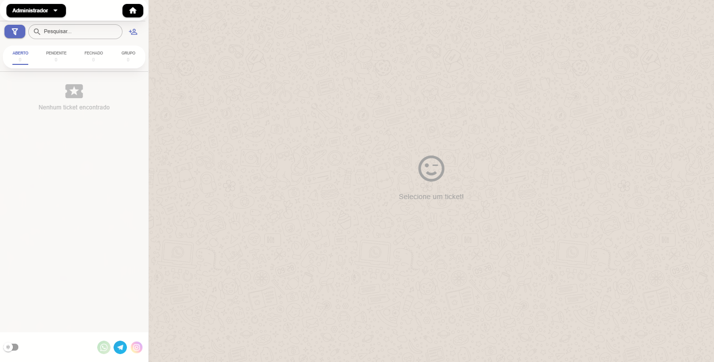

  ### 👥 4. Gestão de Contatos
  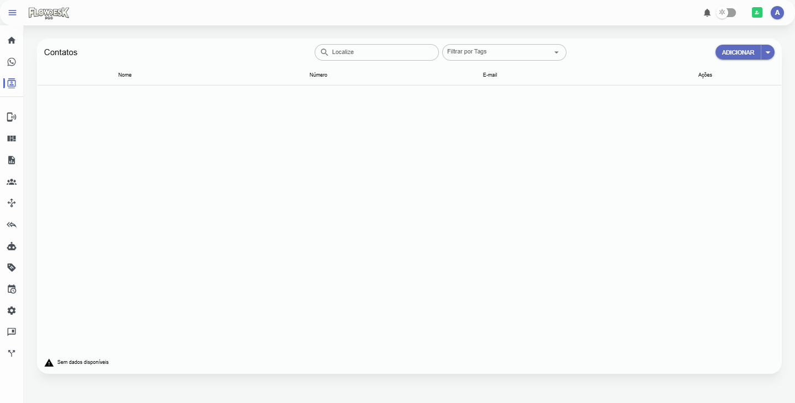

  ### 📱 5. Conexões e Canais (WhatsApp / Telegram / Instagram)
  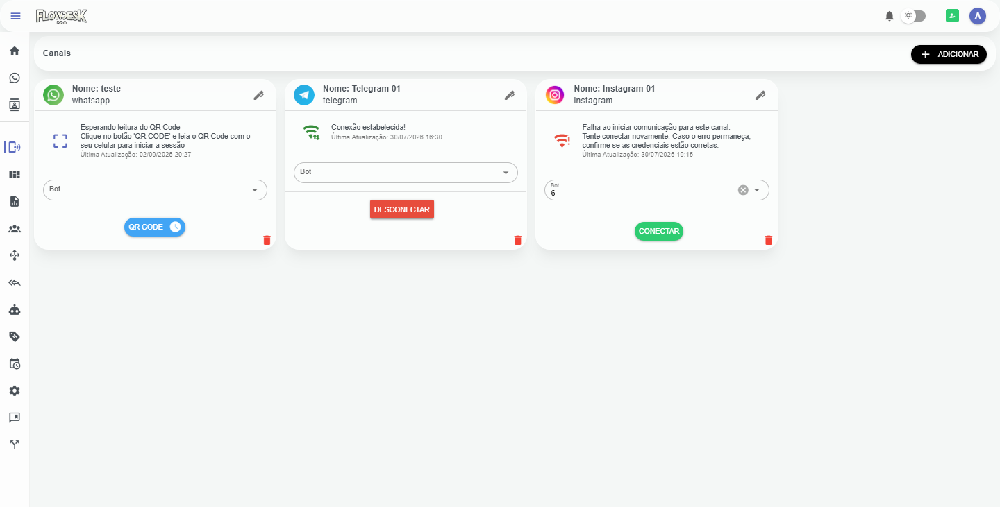

  ### 📲 6. Pareamento via QR Code WhatsApp em Tempo Real
  <div align="center">
    
  </div>

  ### 📈 7. Painel Geral de Atendimentos & Filas
  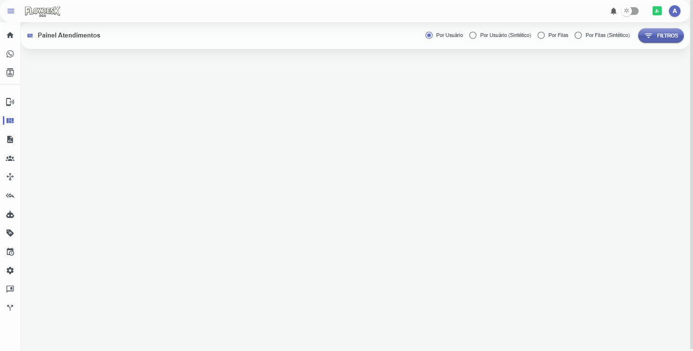

  ### 📑 8. Relatórios Operacionais e Estatísticas
  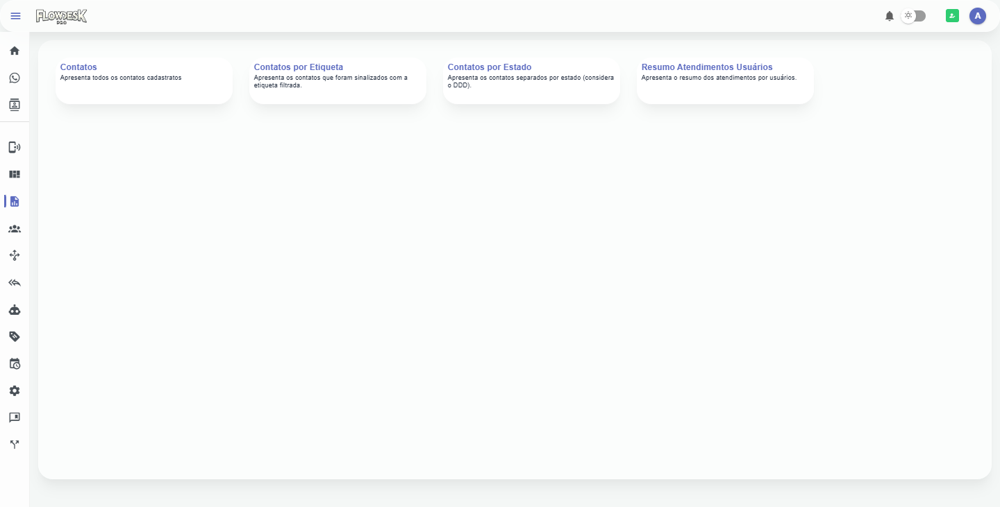

  ### 👤 9. Gestão de Usuários e Operadores
  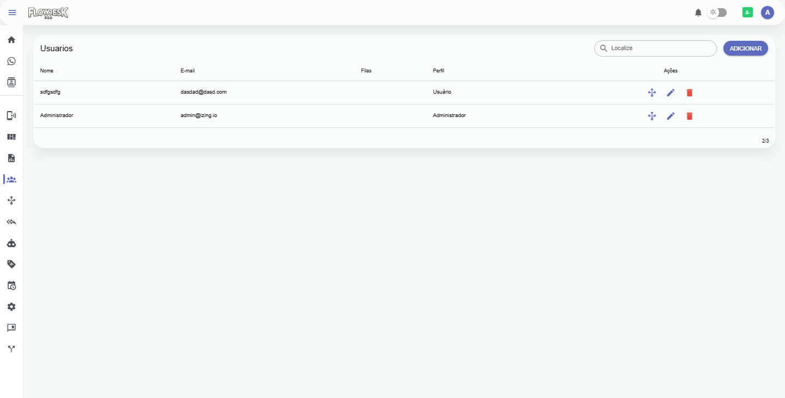

  ### 🗂️ 10. Filas de Atendimento e Triagem Inteligente
  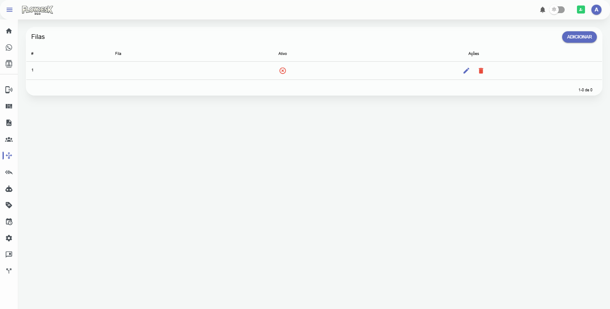

  ### ⚡ 11. Mensagens Rápidas (Atalhos de Resposta)
  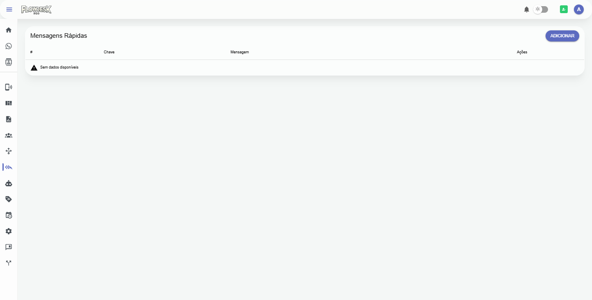

  ### 🤖 12. Chatbot & ChatFlow (Lista de Fluxos)
  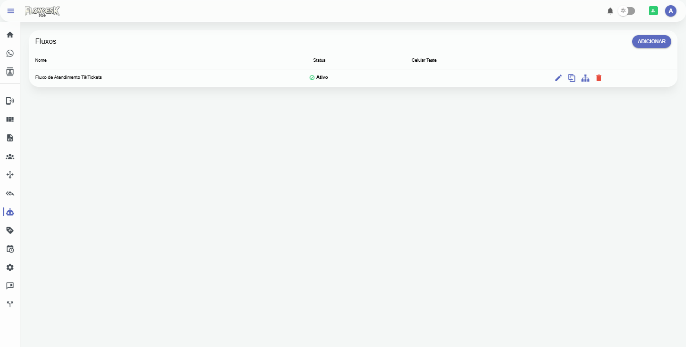

  ### 🛠️ 13. Construtor Visual do Chatbot (ChatFlow Builder)
  <div align="center">
    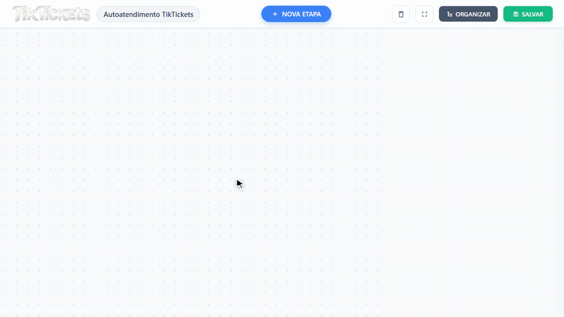
  </div>

  ### 🏷️ 14. Gestão de Etiquetas (Tags)
  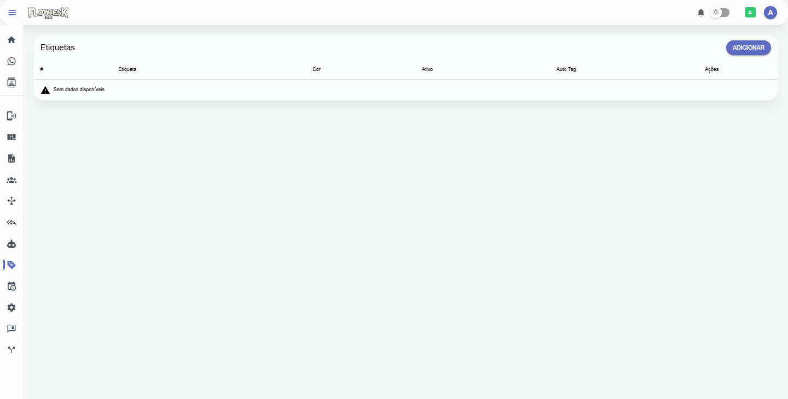

  ### ⏰ 15. Horários de Atendimento & Expediente
  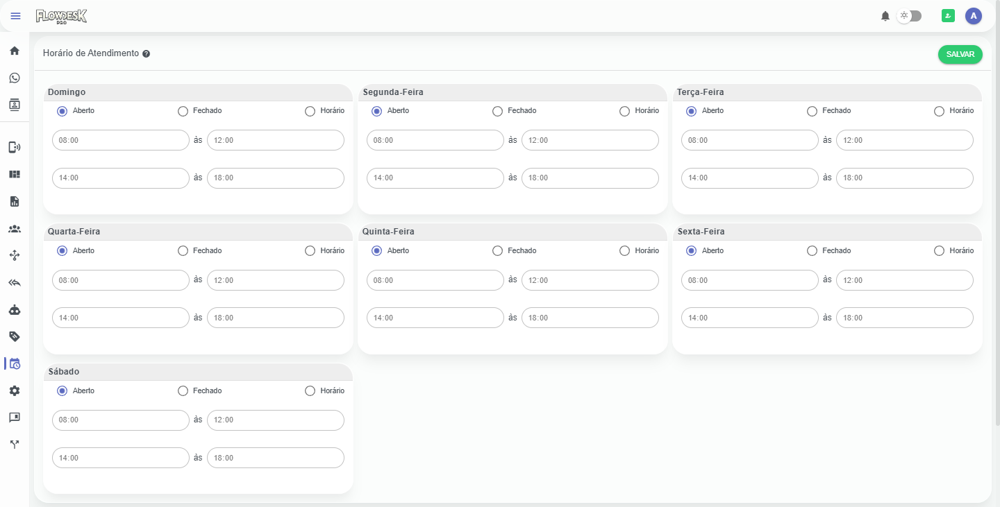

  ### ⚙️ 16. Configurações Globais do Sistema
  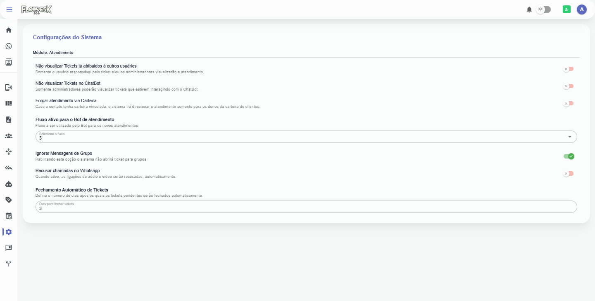

  ### 📢 17. Campanhas de Disparo em Massa
  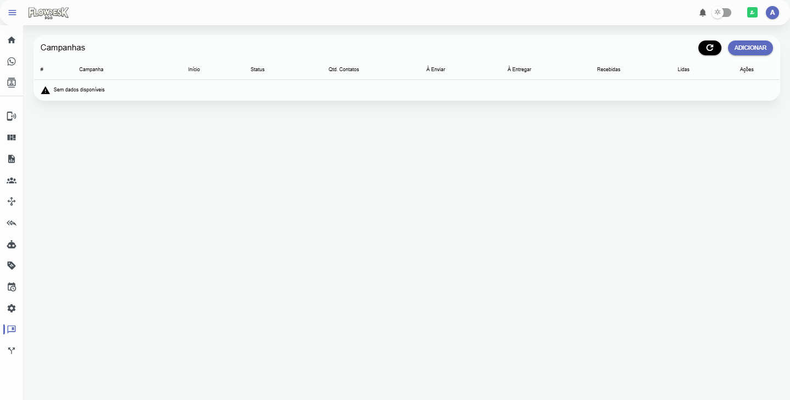

  ### 🔌 18. API & Integrações de Webhook
  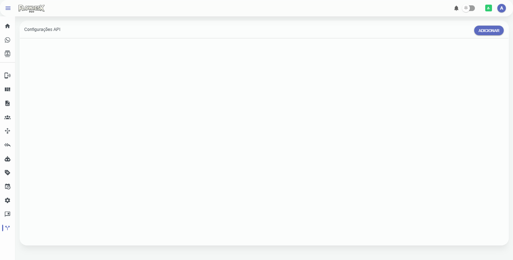

</details>

---

## 💎 Inovações da Versão 3.3.0

- **⚡ Backend Reescrito em Golang (Go 1.25)**:
  - Consumo de memória e CPU drasticamente reduzido.
  - Framework **Echo v4** para alto rendimento de requisições HTTP.
  - Conexão WhatsApp de alta velocidade via biblioteca nativa **whatsmeow**.
  - Processamento assíncrono de tarefas e filas com **Redis + Asynq**.
  - Persistência e migrations automáticas com **GORM + PostgreSQL**.
  - WebSockets em tempo real de baixíssima latência com **Gorilla WebSocket**.

- **🔥 Frontend Moderno em Vue 3.5 & Vite**:
  - Build ultra-rápido com Vite e Quasar Framework 2.17.
  - Gerenciamento de estado reativo e tipado com **Pinia** (substituindo o Vuex legado).
  - Lógica organizada em **Composables** modulares.
  - Validação declarativa de formulários com **Vee-Validate & Zod**.
  - Suporte a testes unitários automatizados com **Vitest**.
  - Unificação definitiva do frontend diretamente na pasta `/frontend`.

- **🎙️ Engine Real-MP3 (LameJS)**:
  - Sistema de gravação de áudio nativo com codificação MP3 em tempo real diretamente no navegador.

- **📈 Observabilidade e Telemetria**:
  - Integração de rastreamento com **OpenTelemetry** e monitoramento de erros com **Sentry**.
  - Stack de observabilidade compatível com Prometheus, Loki e Grafana.

---

## 🛠️ Ecossistema Tecnológico

### **Backend (Golang)**
- **Go 1.25**: Linguagem compilada de alta performance e concorrência.
- **Echo v4**: Framework web REST leve e veloz.
- **whatsmeow**: Biblioteca nativa Go para conexão com o protocolo do WhatsApp.
- **GORM**: ORM moderno para PostgreSQL com automigrations.
- **Redis & Asynq**: Fila assíncrona para disparos em massa, campanhas e workers.
- **Gorilla WebSocket**: Conexão bidirecional em tempo real para sincronização instantânea.
- **JWT (golang-jwt/v5)**: Autenticação segura stateless multi-tenant.

### **Frontend (Vue 3)**
- **Vue.js 3.5**: Core framework reativo com Composition API.
- **Quasar Framework 2.17+**: Componentes de interface e suporte PWA/SPA.
- **Pinia**: Gerenciamento de estado global descentralizado.
- **Vite**: Ferramenta de build de última geração.
- **Vee-Validate 4 & Zod**: Validação robusta de formulários e schemas.
- **Wavesurfer.js**: Player e visualizador de ondas sonoras para mensagens de voz.

---

## 🚀 Funcionalidades Principais

- **Multicanais**: WhatsApp (whatsmeow), Telegram, Instagram e Messenger.
- **Multi-tenant**: Suporte nativo a múltiplas empresas no mesmo banco (SaaS).
- **Chatbot Inteligente**: Construtor visual de fluxos interativos (ChatFlow).
- **Disparos e Campanhas**: Envio de mensagens em massa com agendamento e controle de atraso.
- **Mensagens Rápidas & Tags**: Respostas predefinidas e categorização de conversas por etiquetas.
- **Mídias Completas**: Suporte a áudio gravado nativamente em MP3, imagens, vídeos e documentos.
- **Gestão de Equipe**: Filas de atendimento, horários de funcionamento e controle de permissões.

---

## ⚙️ Instalação e Setup

### 1. Pré-requisitos
- **Go 1.25+**
- **Node.js 22+** e **npm**
- **PostgreSQL 14+**
- **Redis 7+**

### 2. Configuração de Variáveis de Ambiente
- Copie o arquivo de exemplo no backend:
  ```bash
  cd backend
  cp .env.example .env
  ```
- Configure suas credenciais de banco de dados, Redis e chaves JWT no `.env`.

- Copie o arquivo de exemplo no frontend:
  ```bash
  cd ../frontend
  cp .env.example .env
  ```

### 3. Executando o Backend
```bash
cd backend
go run ./cmd/api
# Ou usando o script start.bat (Windows) / ./start.sh (Linux/macOS)
```
> O backend em Go realiza as migrações do banco de dados e o seed inicial automaticamente na primeira inicialização!

### 4. Executando o Frontend
```bash
cd frontend
npm install
npm run dev
```

---

## 🔑 Credenciais Padrão

Para o acesso inicial ao sistema:

- **Usuário Painel SaaS / Superadmin**: `super@izing.io` | **Senha**: `123456`
- **Usuário Atendente Padrão**: `admin@izing.io` | **Senha**: `123456`

---

## ⚠️ Aviso Legal
O uso deste software é de sua responsabilidade. Este projeto de código aberto não possui afiliação oficial com a WhatsApp Inc. / Meta.

**Desenvolvido com excelência pela comunidade TikTickets!** 🎉✨🏆
