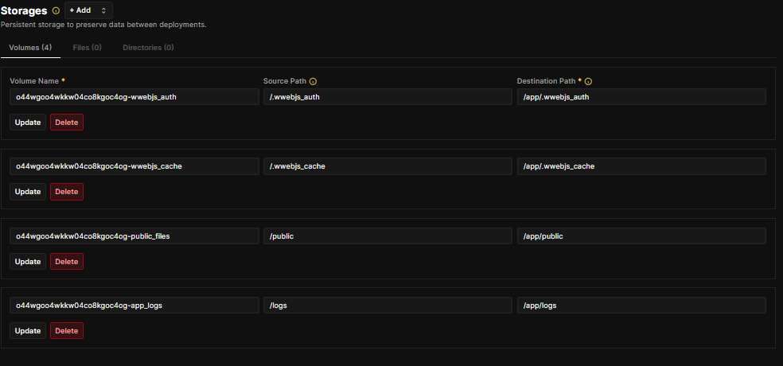

# 🚀 Guia de Deploy no Coolify - TikTickets-zing

Este guia cobre o passo-a-passo completo para colocar o **TikTickets-zing** no ar usando o Coolify, com Frontend e Backend separados.

---

## 1. Preparação (Banco de Dados e Redis) - **OBRIGATÓRIO**

Antes de criar o Backend, você **precisa** criar os serviços de dados no Coolify. O Backend não funciona sem eles.

1.  **PostgreSQL**:
    *   Clique em **+ New** > **Database** > **PostgreSQL**.
    *   Após criar, copie o **Internal Host** (geralmente um código como `q04cgcos...` ou `postgresql-xyz`).
    *   Copie também: **User**, **Password** e **Database Name**.
    *   **Importante**: Abra o terminal deste container no Coolify e crie o banco manualmente se necessário:
        ```bash
        psql -U postgres
        CREATE DATABASE flowdeskpro;
        \q
        exit
        ```

2.  **Redis**:
    *   Clique em **+ New** > **Database** > **Redis**.
    *   Após criar, copie o **Internal Host** (ex: `redis-xyz` ou código `c84cg...`).
    *   Não precisa de senha normalmente (se tiver, anote).

---

## 2. Backend (API Node.js)

1.  **Criar Recurso**:
    *   **Source**: Public Repository (ou Private).
    *   **Repository URL**: `https://github.com/jvkabum/TikTickets-zing`
    *   **Branch**: `master`.

2.  **Configuração (General)**:
    *   **Build Pack**: `Dockerfile`.
    *   **Base Directory**: `/backend`.
    *   **Dockerfile Location**: `/Dockerfile`.
    *   **Port Expose**: `3000`.
    *   **Domains**: Configure seu domínio (ex: `https://api.seudominio.com`).

3.  **Variáveis de Ambiente (CRÍTICO ⚠️)**:
    *   Vá para a aba **Environment Variables**.
    *   **Você DEVE substituir os valores de exemplo pelos dados reais do Passo 1.**

    ```properties
    NODE_ENV=production
    PORT=3000
    PROXY_PORT=80
    
    # URLs
    BACKEND_URL=https://api.seudominio.com
    FRONTEND_URL=https://app.seudominio.com
    VUE_URL_API=https://api.seudominio.com
    VUE_APP_BACKEND_URL=https://api.seudominio.com
    
    # Banco de Dados (PEGUE O "INTERNAL HOST" NO COOLIFY)
    DB_DIALECT=postgres
    DB_PORT=5432
    POSTGRES_HOST=cole_aqui_o_internal_host_do_postgres  <-- MUDE ISSO!
    POSTGRES_USER=postgres
    POSTGRES_PASSWORD=sua_senha_do_banco
    POSTGRES_DB=flowdeskpro
    
    # Redis (PEGUE O "INTERNAL HOST" NO COOLIFY)
    IO_REDIS_SERVER=cole_aqui_o_internal_host_do_redis   <-- MUDE ISSO!
    IO_REDIS_PORT=6379
    IO_REDIS_DB_SESSION=2
    
    # Auth
    JWT_SECRET=troque_isso_por_algo_seguro
    JWT_REFRESH_SECRET=troque_isso_tambem
    ```

4.  **Armazenamento Persistente (CRÍTICO ⚠️)**:
    *   Vá na aba **Storage** > **Add** > **Volume Mount**.
    *   Configure os seguintes volumes para não perder dados (Sessão do WhatsApp, Uploads, Logs):

    | Name (sugestão) | Source Path | Destination Path (Obrigatório) |
    |Str |Str |Str |
    | `wwebjs_auth` | `/.wwebjs_auth` | `/app/.wwebjs_auth` |
    | `wwebjs_cache` | `/.wwebjs_cache` | `/app/.wwebjs_cache` |
    | `public_files` | `/public` | `/app/public` |
    | `app_logs` | `/logs` | `/app/logs` |

    > **Nota:** O "Source Path" é o nome do volume no Docker (pode ser qualquer nome, ex: `/.wwebjs_auth`). O importante é o **Destination Path** estar exato conforme a tabela acima.

    

5.  **Deploy**:
    *   Clique em **Deploy**.
    *   O Backend irá rodar automaticamente as migrações (`db:migrate`) e os seeds (`db:seed:all`) ao iniciar.

---

## 3. Frontend (Vue 3 SPA)

1.  **Criar Recurso**:
    *   Mesmo repositório do backend.
    *   **Branch**: `master`.

2.  **Configuração (General)**:
    *   **Build Pack**: `Dockerfile`.
    *   **Base Directory**: `/frontend-vue-3`.
    *   **Dockerfile Location**: `/Dockerfile`.
    *   **Port Expose**: `80` (⚠️ Importante: Nginx roda na 80).
    *   **Domains**: Configure seu domínio do site (ex: `https://app.seudominio.com`).
    *   **Git Branch**: Garanta que está como `master`.

3.  **Variáveis de Ambiente**:
    *   **VUE_URL_API**: `https://api.seudominio.com` (O domínio do seu Backend).
    *   ⚠️ Marque a opção **"Available at Buildtime"**. Isso é obrigatório para o Vue compilar.

4.  **Deploy**:
    *   Clique em Deploy.
    *   O Dockerfile irá compilar o projeto e servir com Nginx.

---

## Solução de Problemas Comuns

*   **Erro "Remote branch main not found"**:
    *   Vá em Configuration > General e mude o **Git Branch** para `master`.

*   **Erro de Conexão com Banco**:
    *   Verifique se `POSTGRES_HOST` no backend é o "Internal Host" do Coolify, não `localhost`.
    *   Verifique se criou o banco `flowdeskpro` manualmente via terminal.

*   **Erro 502 Bad Gateway no Frontend**:
    *   Verifique se a porta exposta no Coolify (Network) está com valor `80`.

*   **Erro "Rollup failed to resolve import quasar/lang/pt-br.js"**:
    *   Isso já foi corrigido no código (mudança para `pt-BR`), mas certifique-se de estar usando o conteúdo mais recente do repo.
