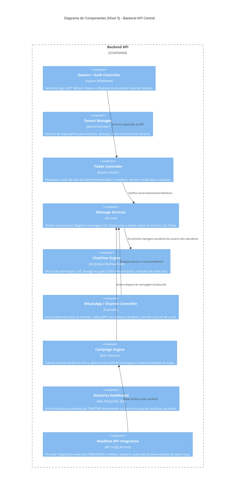

```mermaid
C4Component
    title Diagrama de Componentes (Nível 3) - Backend API Central

    Container_Boundary(api, "Backend API") {
        Component(auth_ctrl, "Session / Auth Controller", "Express Middleware", "Gerencia login, JWT, Refresh Tokens e bloqueio multi-tenant isolando sessões.")
        
        Component(tenant_mgr, "Tenant Manager", "AdminController", "Rotinas de superadmin para controle, ativação, cotas e horários de Tenants.")
        
        Component(ticket_ctrl, "Ticket Controller", "Express Router", "Manipula o ciclo de vida dos atendimentos (abrir, transferir, fechar). Atrela filas e usuários.")
        
        Component(msg_svc, "Message Services", "Services", "Núcleo transacional. Registra mensagens I/O, marca acks e anexa status ao histórico do Ticket.")
        
        Component(chatflow_engine, "ChatFlow Engine", "VerifyStepsChatFlowTicket", "Motor de automação I.V.R. Navega no grafo JSON interpretando condições de menu bot.")
        
        Component(channel_mgr, "WhatsApp / Channel Controller", "Controller", "Inicia instâncias wbot no servidor, injeta JWT nos callbacks da Meta, controla vida útil do canal.")
        
        Component(campaign_worker, "Campaign Engine", "Bull / Services", "Calcula atrasos dinâmicos (P.A.), aplica sorteio A/B de mensagens e injeta templates do Pupa.")
        
        Component(stats_engine, "Statistics Dashboard", "Raw PostgreSQL SQL", "Extrai indicadores pesados de TMA/TME diretamente no banco via queries analíticas escalares.")
        
        Component(api_inbound, "Headless API Integration", "API Config Services", "Permite integrações externas (CRMs/ERPs) e enfileira disparos automáticos desacoplados do event loop.")
    }

    Rel(auth_ctrl, ticket_ctrl, "Autoriza requisição via JWT")
    Rel(ticket_ctrl, msg_svc, "Notifica encerramento/transferência")
    Rel(channel_mgr, msg_svc, "Despeja eventos in-bound webhook")
    Rel(msg_svc, chatflow_engine, "Encaminha mensgem pendente de usuário sem atendente")
    Rel(campaign_worker, msg_svc, "Aciona disparo de mensagem (outbound)")
    Rel(api_inbound, campaign_worker, "Pode enfileirar jobs via Redis")
```
