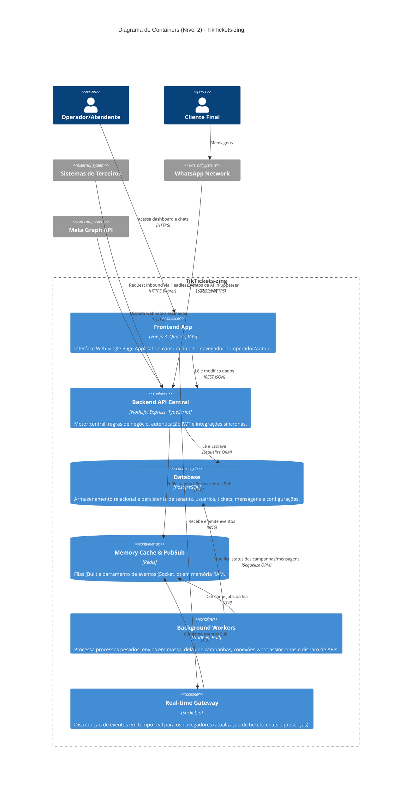

```mermaid
C4Container
    title Diagrama de Containers (Nível 2) - TikTickets-zing

    Person(operador, "Operador/Atendente")
    Person(cliente, "Cliente Final")
    System_Ext(external_api, "Sistemas de Terceiros")

    System_Boundary(tiktickets, "TikTickets-zing") {
        Container(spa, "Frontend App", "Vue.js 3, Quasar, Vite", "Interface Web Single Page Application consumida pelo navegador do operador/admin.")
        
        Container(api, "Backend API Central", "Node.js, Express, TypeScript", "Motor central, regras de negócio, autenticação JWT e integrações síncronas.")
        
        ContainerDb(db, "Database", "PostgreSQL", "Armazenamento relacional e persistente de tenants, usuários, tickets, mensagens e configurações.")
        
        ContainerDb(redis, "Memory Cache & PubSub", "Redis", "Filas (Bull) e barramento de eventos (Socket.io) em memória RAM.")
        
        Container(worker, "Background Workers", "Node.js, Bull", "Processa processos pesados: envios em massa, delay de campanhas, conexões wbot assíncronas e disparo de APIs.")
        
        Container(socket, "Real-time Gateway", "Socket.io", "Distribuição de eventos em tempo real para os navegadores (atualização de tickets, chats e presenças).")
    }

    System_Ext(whatsapp, "WhatsApp Network")
    System_Ext(meta, "Meta Graph API")

    Rel(operador, spa, "Acessa dashboard e chats", "HTTPS")
    Rel(spa, api, "Lê e modifica dados", "REST JSON")
    Rel(spa, socket, "Recebe e emite eventos", "WSS")
    
    Rel(api, db, "Lê e Escreve", "Sequelize ORM")
    Rel(worker, db, "Modifica status das campanhas/mensagens", "Sequelize ORM")
    
    Rel(api, redis, "Enfileira Jobs / Envia eventos Pub", "TCP")
    Rel(worker, redis, "Consome Jobs da fila", "TCP")
    Rel(socket, redis, "Consome eventos Sub", "TCP")
    
    Rel(external_api, api, "Request Inbound via Headless API", "HTTPS Bearer")

    Rel(cliente, whatsapp, "Mensagens")
    Rel(whatsapp, api, "Eventos da API/Puppeteer", "WSS / HTTPS")
    Rel(meta, api, "Dispara webhooks assinados", "HTTPS")
```
