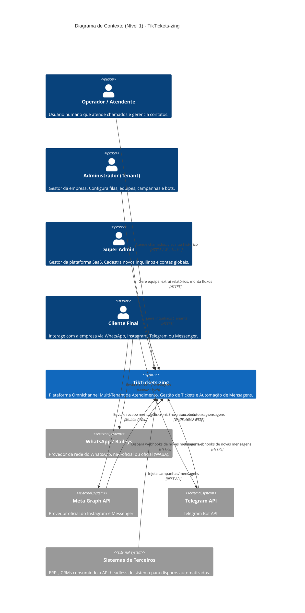

```mermaid
C4Context
    title Diagrama de Contexto (Nível 1) - TikTickets-zing

    Person(operador, "Operador / Atendente", "Usuário humano que atende chamados e gerencia contatos.")
    Person(admin, "Administrador (Tenant)", "Gestor da empresa. Configura filas, equipes, campanhas e bots.")
    Person(superadmin, "Super Admin", "Gestor da plataforma SaaS. Cadastra novos inquilinos e contas globais.")
    Person(cliente, "Cliente Final", "Interage com a empresa via WhatsApp, Instagram, Telegram ou Messenger.")

    System(tiktickets, "TikTickets-zing", "Plataforma Omnichannel Multi-Tenant de Atendimento, Gestão de Tickets e Automação de Mensagens.")

    System_Ext(whatsapp, "WhatsApp / Baileys", "Provedor da rede do WhatsApp, não-oficial ou oficial (WABA).")
    System_Ext(meta, "Meta Graph API", "Provedor oficial do Instagram e Messenger.")
    System_Ext(telegram, "Telegram API", "Telegram Bot API.")
    System_Ext(external_api, "Sistemas de Terceiros", "ERPs, CRMs consumindo a API headless do sistema para disparos automatizados.")

    Rel(operador, tiktickets, "Atende chamados, visualiza histórico", "HTTPS / WebSocket")
    Rel(admin, tiktickets, "Gere equipe, extrai relatórios, monta fluxos", "HTTPS")
    Rel(superadmin, tiktickets, "Gere inquilinos (Tenants)", "HTTPS")
    
    Rel(cliente, whatsapp, "Envia e recebe mensagens", "Mobile / Web")
    Rel(cliente, meta, "Envia e recebe mensagens", "Mobile / Web")
    Rel(cliente, telegram, "Envia e recebe mensagens", "Mobile / Web")

    Rel(whatsapp, tiktickets, "Sincroniza eventos, contatos e mensagens", "WebSocket / HTTP")
    Rel(meta, tiktickets, "Dispara webhooks de novas mensagens", "HTTPS")
    Rel(telegram, tiktickets, "Dispara webhooks de novas mensagens", "HTTPS")
    Rel(external_api, tiktickets, "Injeta campanhas/mensagens", "REST API")
```
