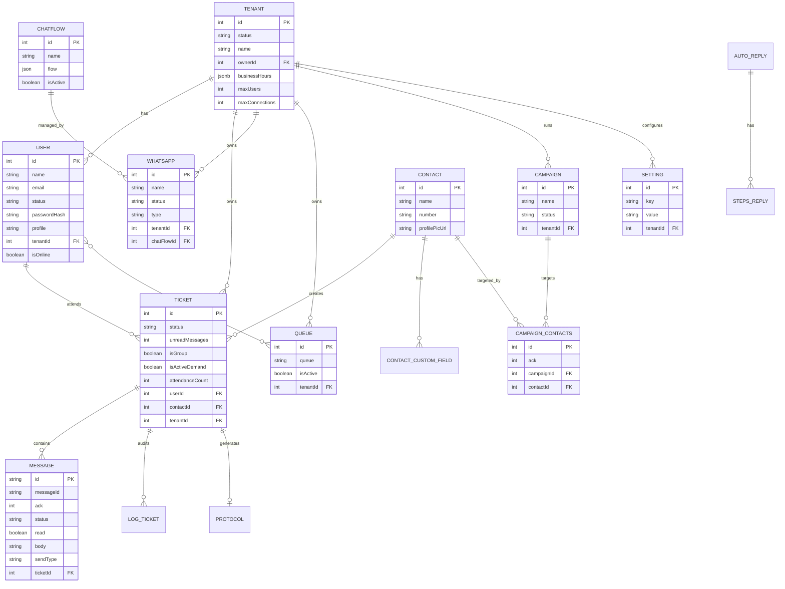

```mermaid
erDiagram
    TENANT ||--o{ USER : "has"
    TENANT ||--o{ TICKET : "owns"
    TENANT ||--o{ WHATSAPP : "owns"
    TENANT ||--o{ QUEUE : "owns"
    TENANT ||--o{ CAMPAIGN : "runs"
    TENANT ||--o{ SETTING : "configures"

    USER ||--o{ TICKET : "attends"
    USER }o--o{ QUEUE : "assigned_to (UsersQueues)"

    CONTACT ||--o{ TICKET : "creates"
    CONTACT ||--o{ CONTACT_CUSTOM_FIELD : "has"

    TICKET ||--o{ MESSAGE : "contains"
    TICKET ||--o{ LOG_TICKET : "audits"
    TICKET ||--o| PROTOCOL : "generates"

    CHATFLOW ||--o{ WHATSAPP : "managed_by"

    CAMPAIGN ||--o{ CAMPAIGN_CONTACTS : "targets"
    CONTACT ||--o{ CAMPAIGN_CONTACTS : "targeted_by"

    AUTO_REPLY ||--o{ STEPS_REPLY : "has"

    TENANT {
        int id PK
        string status
        string name
        int ownerId FK
        jsonb businessHours
        int maxUsers
        int maxConnections
    }
    USER {
        int id PK
        string name
        string email
        string status
        string passwordHash
        string profile
        int tenantId FK
        boolean isOnline
    }
    TICKET {
        int id PK
        string status
        int unreadMessages
        boolean isGroup
        boolean isActiveDemand
        int attendanceCount
        int userId FK
        int contactId FK
        int tenantId FK
    }
    CONTACT {
        int id PK
        string name
        string number
        string profilePicUrl
    }
    MESSAGE {
        string id PK
        string messageId
        int ack
        string status
        boolean read
        string body
        string sendType
        int ticketId FK
    }
    WHATSAPP {
        int id PK
        string name
        string status
        string type
        int tenantId FK
        int chatFlowId FK
    }
    QUEUE {
        int id PK
        string queue
        boolean isActive
        int tenantId FK
    }
    CHATFLOW {
        int id PK
        string name
        json flow
        boolean isActive
    }
    CAMPAIGN {
        int id PK
        string name
        string status
        int tenantId FK
    }
    CAMPAIGN_CONTACTS {
        int id PK
        int ack
        int campaignId FK
        int contactId FK
    }
    SETTING {
        int id PK
        string key
        string value
        int tenantId FK
    }
```
