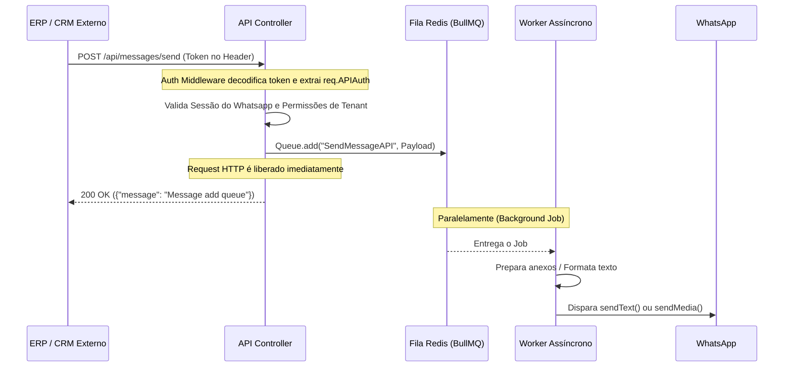

# Fluxos do Módulo `api-integration`

## Disparo Externo com Offloading para Worker (Redis)

```mermaid
sequenceDiagram
    participant External_CRM as ERP / CRM Externo
    participant APIExternalController as API Controller
    participant Bull_Redis as Fila Redis (BullMQ)
    participant Wbot_Worker as Worker Assíncrono
    
    External_CRM->>APIExternalController: POST /api/messages/send (Token no Header)
    Note over APIExternalController: Auth Middleware decodifica token e extrai req.APIAuth
    APIExternalController->>APIExternalController: Valida Sessão do Whatsapp e Permissões de Tenant
    
    APIExternalController->>Bull_Redis: Queue.add("SendMessageAPI", Payload)
    Note over APIExternalController: Request HTTP é liberado imediatamente
    APIExternalController-->>External_CRM: 200 OK ({"message": "Message add queue"})
    
    Note over Bull_Redis, Wbot_Worker: Paralelamente (Background Job)
    Bull_Redis-->>Wbot_Worker: Entrega o Job
    Wbot_Worker->>Wbot_Worker: Prepara anexos / Formata texto
    Wbot_Worker->>WhatsApp: Dispara sendText() ou sendMedia()
```
