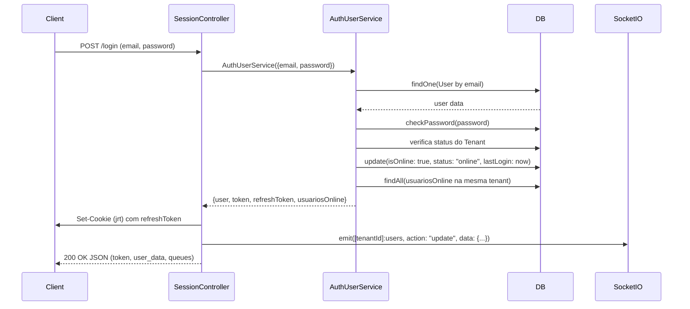

# Fluxos do Módulo `auth`

## Fluxo de Login (`SessionController.store`)

```mermaid
sequenceDiagram
    participant Client
    participant SessionController
    participant AuthUserService
    participant DB
    participant SocketIO

    Client->>SessionController: POST /login (email, password)
    SessionController->>AuthUserService: AuthUserService({email, password})
    AuthUserService->>DB: findOne(User by email)
    DB-->>AuthUserService: user data
    AuthUserService->>DB: checkPassword(password)
    AuthUserService->>DB: verifica status do Tenant
    AuthUserService->>DB: update(isOnline: true, status: "online", lastLogin: now)
    AuthUserService->>DB: findAll(usuariosOnline na mesma tenant)
    AuthUserService-->>SessionController: {user, token, refreshToken, usuariosOnline}
    SessionController->>Client: Set-Cookie (jrt) com refreshToken
    SessionController->>SocketIO: emit([tenantId]:users, action: "update", data: {...})
    SessionController-->>Client: 200 OK JSON (token, user_data, queues)
```
