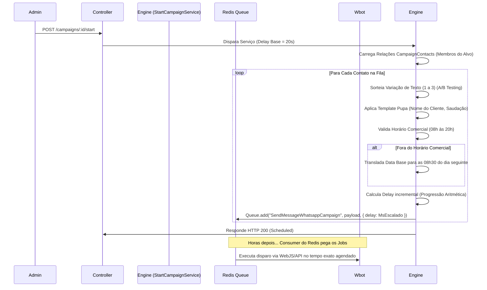

# Fluxos do Módulo `campaigns`

## Pipeline de Envio Massivo Escalado (Anti-Spam)

```mermaid
sequenceDiagram
    participant Admin
    participant Controller
    participant Engine (StartCampaignService)
    participant Redis Queue
    participant Wbot
    
    Admin->>Controller: POST /campaigns/:id/start
    Controller->>Engine: Dispara Serviço (Delay Base = 20s)
    
    Engine->>Engine: Carrega Relações CampaignContacts (Membros do Alvo)
    
    loop Para Cada Contato na Fila
        Engine->>Engine: Sorteia Variação de Texto (1 a 3) (A/B Testing)
        Engine->>Engine: Aplica Template Pupa (Nome do Cliente, Saudação)
        Engine->>Engine: Valida Horário Comercial (08h às 20h)
        
        alt Fora do Horário Comercial
            Engine->>Engine: Translada Data Base para as 08h30 do dia seguinte
        end
        
        Engine->>Engine: Calcula Delay incremental (Progressão Aritmética)
        Engine->>Redis Queue: Queue.add("SendMessageWhatsappCampaign", payload, { delay: MsEscalado })
    end
    
    Engine->>Controller: Responde HTTP 200 (Scheduled)
    
    Note over Redis Queue, Wbot: Horas depois... Consumer do Redis pega os Jobs
    Redis Queue->>Wbot: Executa disparo via WebJS/API no tempo exato agendado
```
