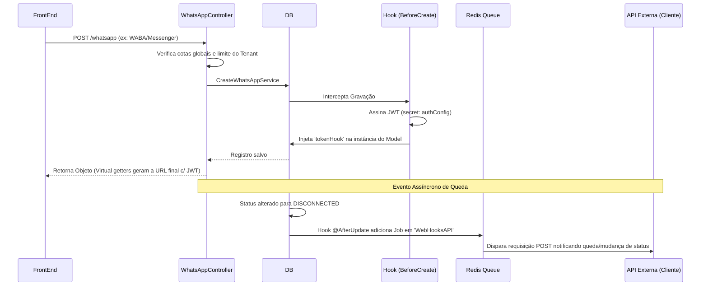

# Fluxos do Módulo `channels`

## Sincronização e Geração de Webhooks Seguros

```mermaid
sequenceDiagram
    participant FrontEnd
    participant WhatsAppController
    participant DB
    participant Hook (BeforeCreate)
    participant Redis Queue
    participant API Externa (Cliente)

    FrontEnd->>WhatsAppController: POST /whatsapp (ex: WABA/Messenger)
    WhatsAppController->>WhatsAppController: Verifica cotas globais e limite do Tenant
    WhatsAppController->>DB: CreateWhatsAppService
    
    DB->>Hook (BeforeCreate): Intercepta Gravação
    Hook (BeforeCreate)->>Hook (BeforeCreate): Assina JWT (secret: authConfig)
    Hook (BeforeCreate)->>DB: Injeta 'tokenHook' na instância do Model
    DB-->>WhatsAppController: Registro salvo

    WhatsAppController-->>FrontEnd: Retorna Objeto (Virtual getters geram a URL final c/ JWT)
    
    Note over WhatsAppController, API Externa (Cliente): Evento Assíncrono de Queda
    DB->>DB: Status alterado para DISCONNECTED
    DB->>Redis Queue: Hook @AfterUpdate adiciona Job em 'WebHooksAPI'
    Redis Queue->>API Externa (Cliente): Dispara requisição POST notificando queda/mudança de status
```
