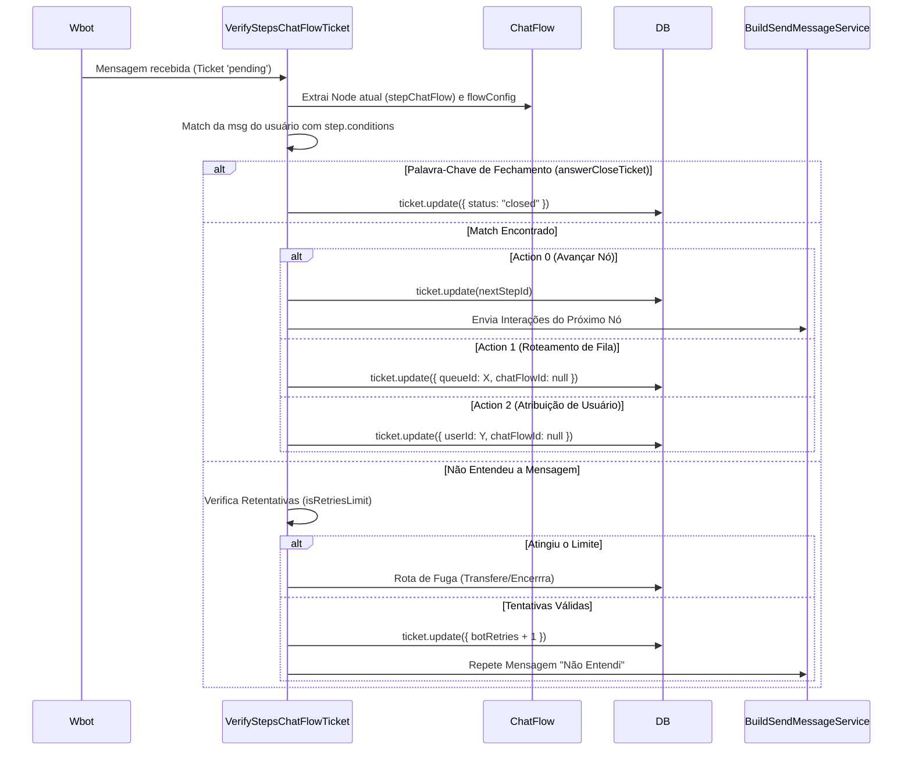

# Fluxos do Módulo `chatflow`

## Motor Vetorial do Bot (Decisão Dinâmica)

```mermaid
sequenceDiagram
    participant Wbot
    participant Verifier as VerifyStepsChatFlowTicket
    participant ChatFlow
    participant DB
    participant Dispatcher as BuildSendMessageService

    Wbot->>Verifier: Mensagem recebida (Ticket 'pending')
    Verifier->>ChatFlow: Extrai Node atual (stepChatFlow) e flowConfig
    Verifier->>Verifier: Match da msg do usuário com step.conditions
    
    alt Palavra-Chave de Fechamento (answerCloseTicket)
        Verifier->>DB: ticket.update({ status: "closed" })
    else Match Encontrado
        alt Action 0 (Avançar Nó)
            Verifier->>DB: ticket.update(nextStepId)
            Verifier->>Dispatcher: Envia Interações do Próximo Nó
        else Action 1 (Roteamento de Fila)
            Verifier->>DB: ticket.update({ queueId: X, chatFlowId: null })
        else Action 2 (Atribuição de Usuário)
            Verifier->>DB: ticket.update({ userId: Y, chatFlowId: null })
        end
    else Não Entendeu a Mensagem
        Verifier->>Verifier: Verifica Retentativas (isRetriesLimit)
        alt Atingiu o Limite
            Verifier->>DB: Rota de Fuga (Transfere/Encerrra)
        else Tentativas Válidas
            Verifier->>DB: ticket.update({ botRetries + 1 })
            Verifier->>Dispatcher: Repete Mensagem "Não Entendi"
        end
    end
```
