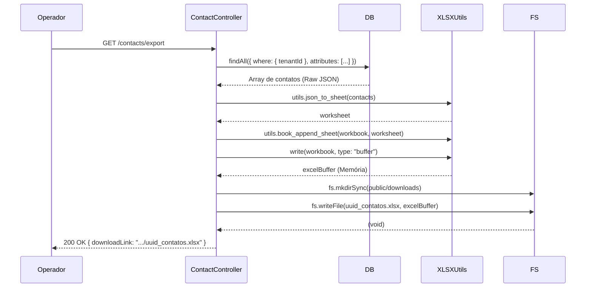

# Fluxos do Módulo `contacts`

## Exportação de Contatos (XLSX)

```mermaid
sequenceDiagram
    participant Operador
    participant ContactController
    participant DB
    participant XLSXUtils
    participant FS

    Operador->>ContactController: GET /contacts/export
    ContactController->>DB: findAll({ where: { tenantId }, attributes: [...] })
    DB-->>ContactController: Array de contatos (Raw JSON)
    ContactController->>XLSXUtils: utils.json_to_sheet(contacts)
    XLSXUtils-->>ContactController: worksheet
    ContactController->>XLSXUtils: utils.book_append_sheet(workbook, worksheet)
    ContactController->>XLSXUtils: write(workbook, type: "buffer")
    XLSXUtils-->>ContactController: excelBuffer (Memória)
    ContactController->>FS: fs.mkdirSync(public/downloads)
    ContactController->>FS: fs.writeFile(uuid_contatos.xlsx, excelBuffer)
    FS-->>ContactController: (void)
    ContactController-->>Operador: 200 OK { downloadLink: ".../uuid_contatos.xlsx" }
```
