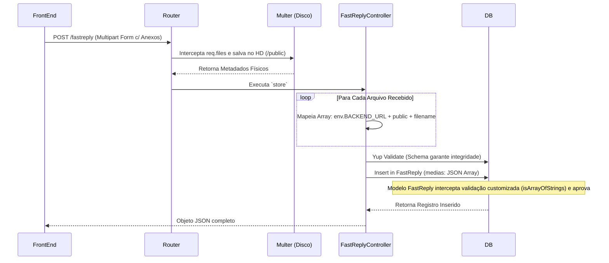

# Fluxos do Módulo `fast-replies`

## Upload Multipart e Bind de Mídia JSON

```mermaid
sequenceDiagram
    participant FrontEnd
    participant Router
    participant Multer (Disco)
    participant FastReplyController
    participant DB
    
    FrontEnd->>Router: POST /fastreply (Multipart Form c/ Anexos)
    Router->>Multer (Disco): Intercepta req.files e salva no HD (/public)
    Multer (Disco)-->>Router: Retorna Metadados Físicos
    Router->>FastReplyController: Executa `store`
    
    loop Para Cada Arquivo Recebido
        FastReplyController->>FastReplyController: Mapeia Array: env.BACKEND_URL + public + filename
    end
    
    FastReplyController->>DB: Yup Validate (Schema garante integridade)
    FastReplyController->>DB: Insert in FastReply (medias: JSON Array)
    
    Note over DB: Modelo FastReply intercepta validação customizada (isArrayOfStrings) e aprova
    DB-->>FastReplyController: Retorna Registro Inserido
    FastReplyController-->>FrontEnd: Objeto JSON completo
```
