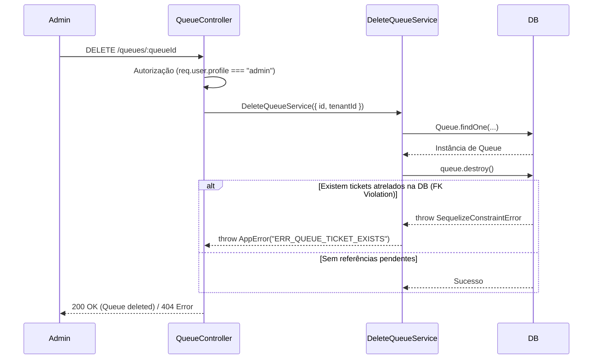

# Fluxos do Módulo `queues`

## Remoção Protegida de Fila de Atendimento

```mermaid
sequenceDiagram
    participant Admin
    participant QueueController
    participant DeleteQueueService
    participant DB

    Admin->>QueueController: DELETE /queues/:queueId
    QueueController->>QueueController: Autorização (req.user.profile === "admin")
    QueueController->>DeleteQueueService: DeleteQueueService({ id, tenantId })
    DeleteQueueService->>DB: Queue.findOne(...)
    DB-->>DeleteQueueService: Instância de Queue
    
    DeleteQueueService->>DB: queue.destroy()
    alt Existem tickets atrelados na DB (FK Violation)
        DB-->>DeleteQueueService: throw SequelizeConstraintError
        DeleteQueueService-->>QueueController: throw AppError("ERR_QUEUE_TICKET_EXISTS")
    else Sem referências pendentes
        DB-->>DeleteQueueService: Sucesso
    end
    
    QueueController-->>Admin: 200 OK (Queue deleted) / 404 Error
```
