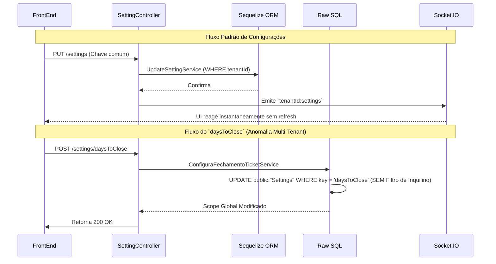

# Fluxos do Módulo `settings`

## Atualização Reativa e Anomalia de Scope

```mermaid
sequenceDiagram
    participant FrontEnd
    participant SettingController
    participant Sequelize ORM
    participant Raw SQL
    participant Socket.IO
    
    Note over FrontEnd, Socket.IO: Fluxo Padrão de Configurações
    FrontEnd->>SettingController: PUT /settings (Chave comum)
    SettingController->>Sequelize ORM: UpdateSettingService (WHERE tenantId)
    Sequelize ORM-->>SettingController: Confirma
    SettingController->>Socket.IO: Emite `tenantId:settings`
    Socket.IO-->>FrontEnd: UI reage instantaneamente sem refresh
    
    Note over FrontEnd, Socket.IO: Fluxo do `daysToClose` (Anomalia Multi-Tenant)
    FrontEnd->>SettingController: POST /settings/daysToClose
    SettingController->>Raw SQL: ConfiguraFechamentoTicketService
    Raw SQL->>Raw SQL: UPDATE public."Settings" WHERE key = 'daysToClose' (SEM Filtro de Inquilino)
    Raw SQL-->>SettingController: Scope Global Modificado
    SettingController->>FrontEnd: Retorna 200 OK
```
