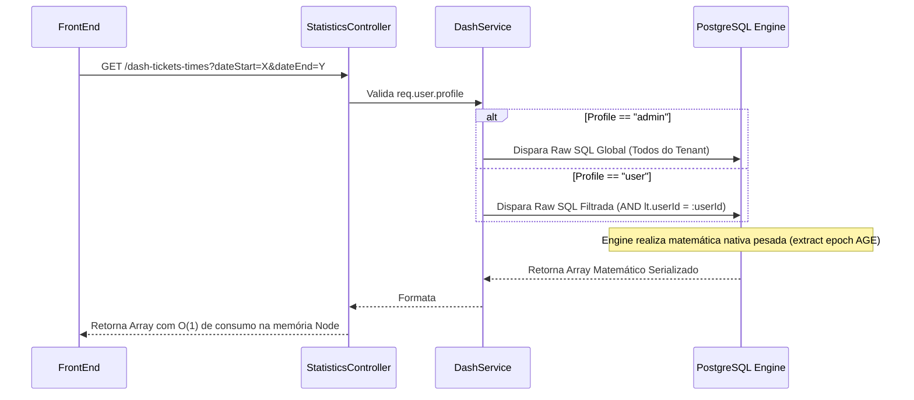

# Fluxos do Módulo `statistics`

## Offloading Computacional Multi-Tenant

```mermaid
sequenceDiagram
    participant FrontEnd
    participant StatisticsController
    participant DashService
    participant PostgreSQL Engine
    
    FrontEnd->>StatisticsController: GET /dash-tickets-times?dateStart=X&dateEnd=Y
    StatisticsController->>DashService: Valida req.user.profile
    
    alt Profile == "admin"
        DashService->>PostgreSQL Engine: Dispara Raw SQL Global (Todos do Tenant)
    else Profile == "user"
        DashService->>PostgreSQL Engine: Dispara Raw SQL Filtrada (AND lt.userId = :userId)
    end
    
    Note over PostgreSQL Engine: Engine realiza matemática nativa pesada (extract epoch AGE)
    PostgreSQL Engine-->>DashService: Retorna Array Matemático Serializado
    DashService-->>StatisticsController: Formata
    StatisticsController-->>FrontEnd: Retorna Array com O(1) de consumo na memória Node
```
