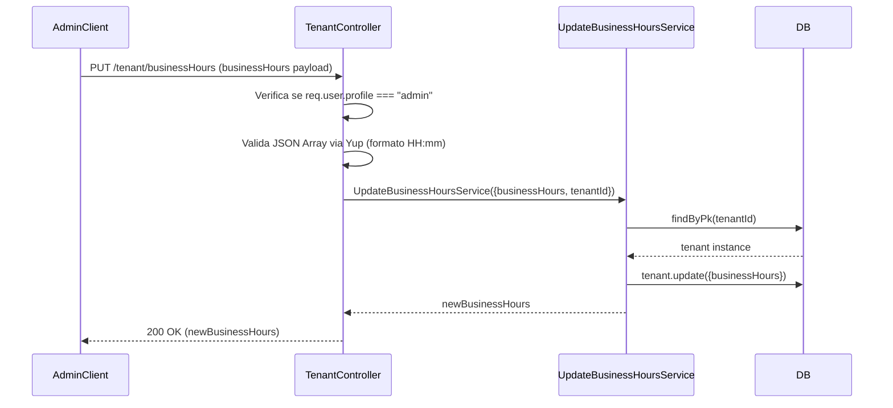

# Fluxos do Módulo `tenants`

## Atualização de Horários de Funcionamento

```mermaid
sequenceDiagram
    participant AdminClient
    participant TenantController
    participant UpdateBusinessHoursService
    participant DB

    AdminClient->>TenantController: PUT /tenant/businessHours (businessHours payload)
    TenantController->>TenantController: Verifica se req.user.profile === "admin"
    TenantController->>TenantController: Valida JSON Array via Yup (formato HH:mm)
    TenantController->>UpdateBusinessHoursService: UpdateBusinessHoursService({businessHours, tenantId})
    UpdateBusinessHoursService->>DB: findByPk(tenantId)
    DB-->>UpdateBusinessHoursService: tenant instance
    UpdateBusinessHoursService->>DB: tenant.update({businessHours})
    UpdateBusinessHoursService-->>TenantController: newBusinessHours
    TenantController-->>AdminClient: 200 OK (newBusinessHours)
```
