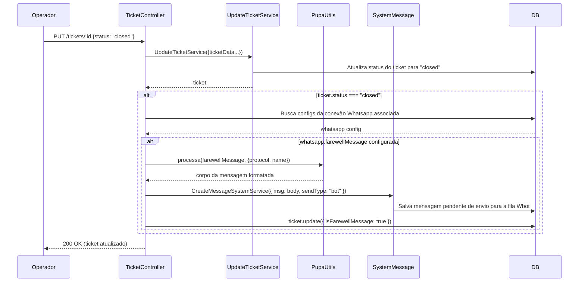

# Fluxos do Módulo `tickets`

## Fechamento de Ticket com Mensagem de Despedida Automática

```mermaid
sequenceDiagram
    participant Operador
    participant TicketController
    participant UpdateTicketService
    participant PupaUtils
    participant SystemMessage
    participant DB

    Operador->>TicketController: PUT /tickets/:id {status: "closed"}
    TicketController->>UpdateTicketService: UpdateTicketService({ticketData...})
    UpdateTicketService->>DB: Atualiza status do ticket para "closed"
    UpdateTicketService-->>TicketController: ticket
    
    alt ticket.status === "closed"
        TicketController->>DB: Busca configs da conexão Whatsapp associada
        DB-->>TicketController: whatsapp config
        
        alt whatsapp.farewellMessage configurada
            TicketController->>PupaUtils: processa(farewellMessage, {protocol, name})
            PupaUtils-->>TicketController: corpo da mensagem formatada
            TicketController->>SystemMessage: CreateMessageSystemService({ msg: body, sendType: "bot" })
            SystemMessage->>DB: Salva mensagem pendente de envio para a fila Wbot
            TicketController->>DB: ticket.update({ isFarewellMessage: true })
        end
    end
    
    TicketController-->>Operador: 200 OK (ticket atualizado)
```
