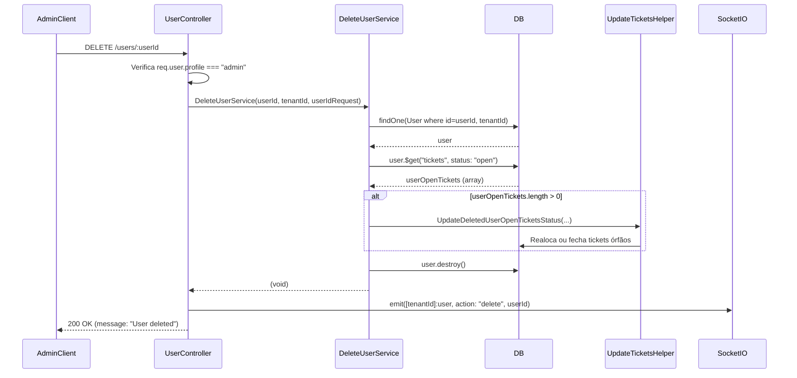

# Fluxos do Módulo `users`

## Deleção Segura de Usuário

```mermaid
sequenceDiagram
    participant AdminClient
    participant UserController
    participant DeleteUserService
    participant DB
    participant UpdateTicketsHelper
    participant SocketIO

    AdminClient->>UserController: DELETE /users/:userId
    UserController->>UserController: Verifica req.user.profile === "admin"
    UserController->>DeleteUserService: DeleteUserService(userId, tenantId, userIdRequest)
    DeleteUserService->>DB: findOne(User where id=userId, tenantId)
    DB-->>DeleteUserService: user
    DeleteUserService->>DB: user.$get("tickets", status: "open")
    DB-->>DeleteUserService: userOpenTickets (array)
    alt userOpenTickets.length > 0
        DeleteUserService->>UpdateTicketsHelper: UpdateDeletedUserOpenTicketsStatus(...)
        UpdateTicketsHelper->>DB: Realoca ou fecha tickets órfãos
    end
    DeleteUserService->>DB: user.destroy()
    DeleteUserService-->>UserController: (void)
    UserController->>SocketIO: emit([tenantId]:user, action: "delete", userId)
    UserController-->>AdminClient: 200 OK (message: "User deleted")
```
