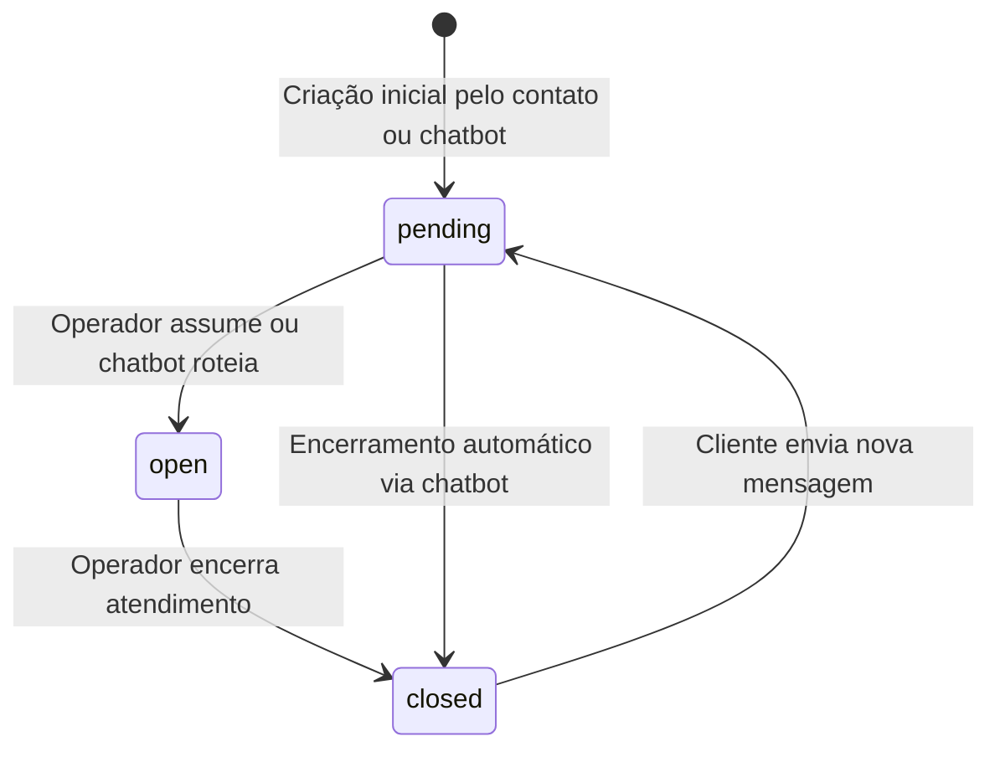
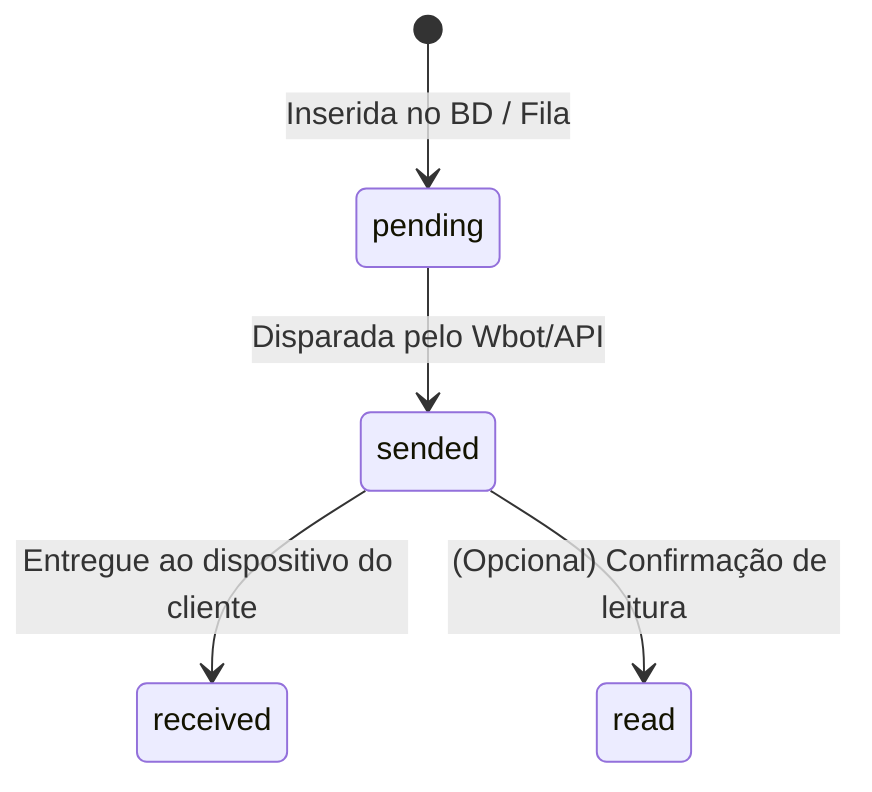
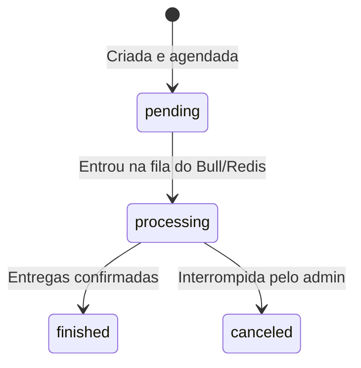
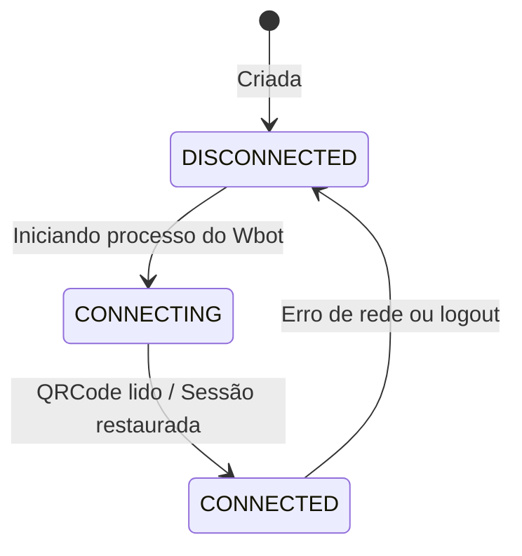

# Máquinas de Estado

> 🟡 INFERIDO

## 1. Ticket
A entidade central de atendimento possui um ciclo de vida baseado no seu `status`.

## 2. Message
Representa o status de entrega do payload textual/mídia para os canais externos.

## 3. Campaign
Disparos em massa em background.

## 4. Whatsapp (Canal/Conexão)
Estado do socket ou integração de rede social.

