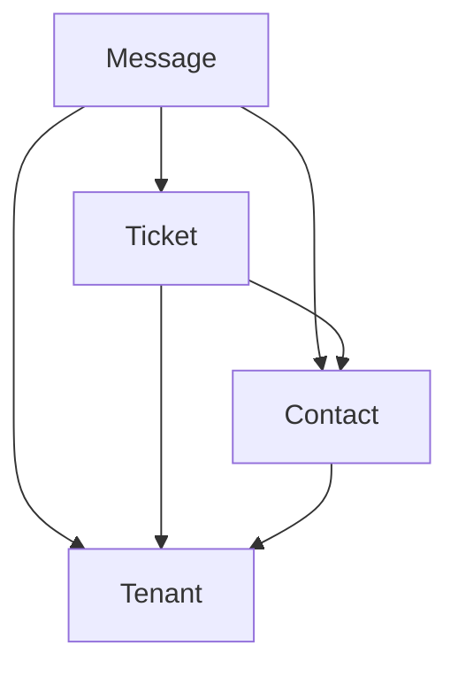

# Documentação da Vinculação de Mensagens no Sistema

## Estrutura de Relacionamentos

### Hierarquia de Entidades


### Modelos e Relacionamentos

```typescript
Message {
  ticketId: number;      // Vínculo com ticket
  contactId: number;     // Vínculo com contato
  tenantId: number;      // Vínculo com tenant
}

Ticket {
  contactId: number;     // Vínculo com contato 
  tenantId: number;      // Vínculo com tenant
}

Contact {
  tenantId: number;      // Vínculo com tenant
}
```

## Fluxo de Processamento de Mensagens

### 1. Determinação do Tenant
```typescript
const tenantId = await getTenantIdByWbotId(wbot.id);
```

### 2. Processamento do Contato
```typescript
let contact = await Contact.findOne({
  where: { 
    number: wbotContact.id._serialized,
    tenantId 
  }
});

if (!contact) {
  contact = await Contact.create({
    number: wbotContact.id._serialized,
    name: wbotContact.name || wbotContact.pushname,
    tenantId
  });
}
```

### 3. Processamento do Ticket
```typescript
let ticket = await Ticket.findOne({
  where: {
    contactId: contact.id,
    tenantId,
    status: { [Op.or]: ["open", "pending"] }
  }
});

if (!ticket) {
  ticket = await Ticket.create({
    contactId: contact.id,
    status: "open",
    tenantId,
    lastMessage: msg._data?.pollName || "Enquete",
    lastMessageAt: Math.floor(Date.now() / 1000)
  });
}
```

### 4. Criação da Mensagem
```typescript
const messageData = {
  messageId: msg.id.id,
  ticketId: ticket.id,
  contactId: contact.id,
  tenantId: ticket.tenantId,
  // outros campos...
};

await CreateMessageService({
  messageData,
  tenantId: ticket.tenantId
});
```

## Verificações de Segurança

### Verificação de Duplicidade
```typescript
const msg = await Message.findOne({
  where: { 
    messageId: messageData.messageId, 
    tenantId 
  }
});
```

### Consultas com Relacionamentos
```typescript
const message = await Message.findOne({
  where: { 
    messageId: messageData.messageId, 
    tenantId 
  },
  include: [
    {
      model: Ticket,
      as: "ticket",
      where: { tenantId },
      include: ["contact"]
    }
  ]
});
```

## Atualizações e Eventos

### Atualização de Status
```typescript
await ticket.update({
  lastMessage: messageData.body,
  lastMessageAt: Math.floor(Date.now() / 1000),
  answered: messageData.fromMe
});
```

### Emissão de Eventos
```typescript
socketEmit({
  tenantId,
  type: "chat:create",
  payload: message
});
```

## Garantias do Sistema

1. Isolamento por Tenant
   - Todas as operações são filtradas por `tenantId`
   - Dados de diferentes tenants não se misturam

2. Integridade Referencial
   - Foreign keys mantêm a consistência dos dados
   - Relacionamentos são validados em todas as operações

3. Rastreabilidade
   - Mensagens são vinculadas a tickets e contatos
   - Histórico completo é mantido

4. Segurança
   - Verificações em múltiplas camadas
   - Validação de permissões por tenant

5. Consistência
   - Status são atualizados automaticamente
   - Eventos são emitidos para sincronização em tempo real 